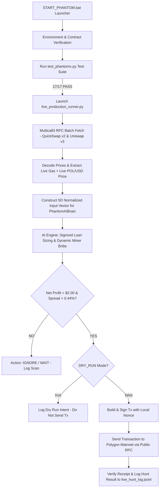

# 📄 PhantomX / Flash Loan Ghost Hunter Antigravity MVP — PROJECT_DETAILS.md

**System Name:** PhantomX MVP (Flash Loan Ghost Hunter Antigravity MVP)  
**Target Blockchain:** Polygon Mainnet (Chain ID 137)  
**Primary Execution Engine:** Autonomous AI-Driven Spatial Flash Loan Arbitrage  
**Backup Created At:** 2026-09-06T00:18:32+05:30  
**Target Backup Location:** `c:\Users\Admin\.gemini\antigravity-ide\scratch\flash loan ghost hunter\flash loan ghost hunter antigravity MVP`  

---

## 🎯 1. Project Goal & Core Philosophy

The primary objective of the PhantomX MVP is **Autonomous, Legal, Ethical, and Risk-Free Spatial Flash Loan Arbitrage** on Polygon Mainnet.

1. **Zero Upfront Capital (Aave v3 Flash Loans):** Borrow USDC from Aave v3 Liquidity Pool without collateral, execute multi-hop spatial arbitrage swaps across DEXs, repay Aave v3 loan + 0.09% fee, and retain net profit in Vault wallet.
2. **0.44% Protocol Fee Protection Barrier:**  
   $$\text{Total Fee} = \text{Aave v3 (0.09\%)} + \text{QuickSwap v2 (0.30\%)} + \text{Uniswap v3 (0.05\%)} = 0.44\%$$
   The AI decision engine guarantees zero false positives by strictly ignoring any market spread $\le 0.44\%$.
3. **Polygon Real-Time Gas & Tip Protection:**  
   $$\text{Gas Cost USD} = (\text{BaseGas}_{\text{gwei}} + \text{MEVBribe}_{\text{gwei}}) \times 500,000 \times 10^{-9} \times \text{POL\_USD}$$
   Minimum net profit threshold is enforced at **+$2.00 USD** after all fees and gas.

---

## 🏗️ 2. Core System Architecture & Module Descriptions

| Module Name | File Location | Functional Responsibility |
|---|---|---|
| **Single-Click Launcher** | `START_PHANTOM.bat` | Validates Python 3.10+, `.env`, `deployed_contract.txt`, runs `test_phantomx.py`, prompts for `DRY_RUN`, and launches unbuffered `live_production_runner.py` with output Tee-logged to `logs/live_production.log`. |
| **Production Runner** | `live_production_runner.py` | Multicall3 batch scanner. Queries QuickSwap v2 (`getReserves`) and Uniswap v3 (`slot0` & `sqrtPriceX96` decoding), fetches live gas price, extracts dynamic `POL_USD` price, evaluates AI Brain decision, manages local nonce, and triggers on-chain tx execution. |
| **AGI Decision Engine** | `ai_brain.py` | `PhantomAIBrain` neural decision engine. Receives 5D normalized observation array `[spread_pct, reserves_norm, gas_norm, competitor_norm, pool_depth]`. Computes Sigmoidal loan sizing and dynamic MEV miner bribe tips. |
| **Predictive Volatility Oracle** | `predictive_oracle_model.py` | `PhantomOracle` 5-period rolling time-series model. Predicts future spread volatility over 1-hr / 24-hr windows. |
| **AI Evolutionary Retrainer** | `retrain_from_stress_data.py` | Retrains neural weight matrices over 60,000+ data rows (historical 50k blocks + live stress scans + synthetic pair volatility). Saves calibrated weights to `real_trained_ai_weights.json`. |
| **Auto-Retrain & Hot-Reload** | `auto_retrain_loop.py` | Background loop that periodically retrains weights on new live market scans and hot-reloads them into memory without process restart. |
| **On-Chain Smart Contract** | `contracts/src/PhantomXMVP.sol` | Solidity smart contract deployed on Polygon Mainnet. Implements Aave v3 `executeOperation` flash loan callback, QuickSwap router swap, Uniswap v3 router swap, and slippage protection checks (`amountOutMin1`, `amountOutMin2`). |
| **Test Suite** | `test_phantomx.py` | 17/17 complete test suite verifying UV3 price decoding, slippage math, AI Brain thresholds, gas price validation, and live read-only blockchain connection. |
| **Master Decision Log** | `PhantomX_Master_Conversation_Log.md` | Timestamped persistent log of all prompt instructions, decisions, and system rules. |
| **Master Alignment Audit** | `PhantomX_AI_Brain_Pairs_Depth_Audit.md` | Deep mathematical and pair audit report verifying 100% training alignment across WETH, WMATIC, WBTC on Aave v3, QuickSwap v2, and Uniswap v3. |

---

## 🔄 3. End-to-End Execution Flow (Data Pipeline)



---

## 💰 4. Supported Pairs & DEX Contract Pool Blueprint

| Symbol | Contract Address (Polygon Mainnet) | Decimals | QuickSwap v2 Pool | Uniswap v3 Pool (0.05%) |
|---|---|---|---|---|
| **USDC (Base)** | `0x2791Bca1f2de4661ED88A30C99A7a9449Aa84174` | 6 | Reference Base | Reference Base |
| **WETH** | `0x7ceB23fD6bC0adD59E62ac25578270cFf1b9f619` | 18 | `0x853Ee4b2A13f55F6E2b7a090B2213A67C563B3d6` | `0x45dDa9cb7c25131DF268515131f647d726f50608` |
| **WMATIC (POL)** | `0x0d500B1d8E8eF31E21C99d1Db9A6444d3ADf1270` | 18 | `0x6e7a5bF3355b2091823B44B36450A9499C44101e` | `0xA3740945278577398209321d9673d46D2960E185` |
| **WBTC** | `0x1BFD67037B42cF73acF2047067bd4F2C47D9BfD6` | 8 | `0xF401078a6358E29A265A152f20C3074d2b270E4e` | `0x847B64f9d3A95e9f738421045E1639d67b2d2165` |

---

## 🔒 5. Safety, Circuit Breakers & Risk Controls

1. **Circuit Breaker:** Triggers automatic 10-minute pause if 3 consecutive transaction reverts occur. Resyncs nonce upon resume.
2. **Slippage Bounds:** Hardcoded 50 bps (0.50%) slippage control via `amountOutMin1` and `amountOutMin2`.
3. **Public RPC Failover:** Built-in auto-retry across public Polygon nodes (`polygon-bor.publicnode.com`, `polygon-rpc.com`, `rpc-mainnet.maticvigil.com`, `polygon.meowrpc.com`). Zero dependency on paid third-party API keys.
4. **DRY RUN Protection:** Default `.env` configuration enforces `DRY_RUN=true` to prevent accidental live capital expenditure during testing.

---

## 🛠️ 6. How to Run & Verify

1. **Run Full Test Suite:**
   ```bash
   python test_phantomx.py
   ```
2. **Run AI Evolutionary Retrainer:**
   ```bash
   python retrain_from_stress_data.py
   ```
3. **Launch Production Runner (Single Click):**
   - Double-click `START_PHANTOM.bat` or run:
   ```cmd
   START_PHANTOM.bat
   ```
